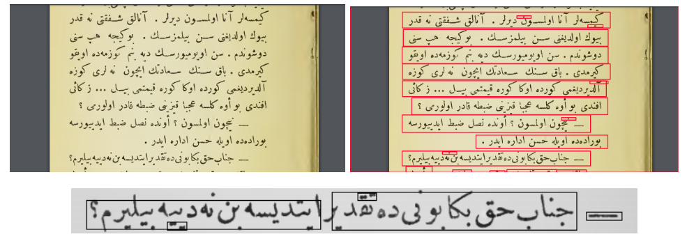

# tesseract-flask-image-classifier
A simple implementation for image classifier web application with Keras and Flask. The application allows to upload image file and determines what animal (<b>Cat</b> or <b>Dog</b>) is located on it with using convolutional neural network builded in Keras.

## Getting Started
These instructions will get you a copy of the project up and running on your local machine for development and testing purposes.
1. Clone this repository with Git Large File Storage(LFS) `git lfs clone https://github.com/mitkir/keras-flask-image-classifier`
2. Open project's directory `cd keras-flask-image-classifier`
3. Install all necessary dependencies `pip install -r requirements.txt`
4. Run application `python application.py`
5. Open `http://127.0.0.1:5000/` on your browser
6. Click the file select button and select test image for classifier.

### Background
The Tesseract model was used in the background of the project. Tesseract is an OCR. OCR is an optical character recognition model. This model has support for many languages. However, there is no Ottoman language support.
Model trainings were done on python. For this reason, web and desktop interfaces have been prepared in python language to be integrated with Tesseract.
Tagging is provided by re-tagging the uploaded documents or images by users over Tesseract predictions.
Platforms were prepared for both accurate data collection and users to receive their own documents digitally.

### Works Related
>In the first stage of the project, data labeled in Ottoman Turkish was tried to be collected. In addition, sample models were investigated. However, we wanted to create our own model when no ready-made model could be found. In this sense, we started to prepare desktop and web platforms to collect accurate and clean data. In this process, we made model improvements on the one hand and application development on the other. In the model improvement and fine-tuning part, the fact that the texts are pictorial because the texts are in Ottoman and the visual processing took us to different research branches. We tried to collect data suitable for model training from web and desktop applications. It has been ensured that these platforms can be used by everyone, send e-mails to the user, and send us the data by email. The user can view the Tesseract evaluations and relabel themselves. It was able to download this data to itself.After this stage, we used the ottoman tutorials to improve on the Tesseract.

>The first of the design elements is the Tesseract model and its fine-tuning. In this sense, it was important to give Ottoman pictures to the mannequin with their tags in model education. It accepted .tif of images and .txt of tags as forms.

>OCR software paper etc. The collection of black dots on it, i.e. letters, numbers, symbols, etc. They have the ability to perceive and read. Analyze by keeping each word separate and dividing the page into lines. During the analysis, the structural characters, heights and widths of the letters are evaluated. The program's own repository is full of various parameters defined for each character. If the detected pixels fit one of these parameters, it becomes possible for the letter to appear.

>Training of this model is provided via docker on the linux platform. And word line segmentation tools are used to make this model trainable.
At the other stage, Flask, HTML, CSS, JS were used in application development in the web part. There is a process where users upload images, view results and save the new tag.
It is important that user data is saved in postal format and in an appropriate format.

>What the user can do from the site is determined in the activity diagram above. From here, we collect data on the admin side, people can enter new tags using the keyboard. He can save them on his side.

>The use-case diagram is given above. The most basic of the functions that the user can do in the web application is the case.
At this stage the Image loads, the image is predicted by the Tesseract. The estimation result is presented to the user. The user either confirms this result or enters the new tag. And these tags are saved. By sending an e-mail, the user sends the data to us by email. The user can also save the data as .txt on his own computer. With the Ottoman keyboard offered to the user, the user can enter the labels with the Ottoman alphabet.

>While Tesseract defines OCR, Tesseract 4.0 added a new OCR engine based on LSTM neural networks. It works well on x86/Linux with official Language Model data available for 100+ languages ​​and 35+ scripts. For Latin-based languages, the available model data provided is trained on approximately 400000 text lines covering approximately 4500 fonts. There aren't as many fonts for other scripts, but they're still trained on a similar number of lines of text.

### DEMO
>The basic point of view of LSTM is Cell State and some available jobs (gates). Cell State can be explained as a communication line and memory of the network for the purposes used for prediction generation. During this time, the short-term memory (short-term memory) problem will be resolved and continue along the old network chain. Transactions that need to be carried through Cell State are specified in the path. This is to indicate preparations as necessary or unnecessary.
>At this stage, data was required for the OCR mode first. Instead of a model from scratch, we wanted to use a model that could be improved and fine tuned. In this sense, Tesseract, version 4, did not provide OCR for Ottoman, but provided functionality for Arabic and many languages. We have prepared a data collection platform in order to improve this Tesseract and produce results in Ottoman Turkish.

>While making model improvements, we also started to prepare web and desktop applications. In this way, it would be a source where users could enter and personally convert pictures into text, tag them, and collect the right data for our model.
In the Tesseract development part, we researched line and word segmentation processes in order to provide more accurate data and visuals. We've seen Tesseract provide some of these itself in the background. However, in addition to this, we worked on line-line and word-by-word separation of Ottoman texts. This allowed us to generate a more accurate entry for Tesseract. However, in the last term, we decided to give input images and tags in the form of paragraphs in order not to lose the semantic and fluid function in the Tesseract.

> In this process, we worked on the Ottoman language documents of some authors such as "Hüseyin Rahmi Gürpınar", which we received from a linguist. And we made the evaluations on the documents. At this stage, my data was in Ottoman Printed format. This was aimed at having cleaner data and increasing the learnability of the model.
We first fed images to the Tesseract and visually checked the results. And with the output we get from the Tesseract, the line, word, etc. on the picture. We were able to access a lot of information. However, the estimations could not be 100% successful since the Ottoman documents included both Persian and Arabic. This continued with developing platforms for labeling data.
 >Web application was prepared in Python language with Flask for good integration. Here, some endpoints and interfaces were integrated. HTML, CSS, JS are used in the interface. In this interface, the basic function is to upload the image by the user, send it to the Tesseract on the back, make a prediction by the Tesseract and produce an output, and present this output to the user. The user examines this output and either approves it or enters a new output himself.

>In the text field where the new output will be entered, an Ottoman keyboard is used for the convenience of the user. This keyboard is also provided to be translated from some keys on the computer keyboard to Ottoman.

> The tabular estimation of the base sheet is shown above. Here we have provided the following ottoman keyboard plugin. Also, when "A" is written on the keyboard, the Ottoman equivalent can be written on the screen. The user uploads the picture, sees the prediction result. Confirms the prediction that comes with Confirm. If the guess is not correct, it enters a new input and traverses it. Moves to the next picture.

>The user also has the ability to download the new result he has written. As a result of the processes, the recorded data was sent to our team via email.

### Validation and Result
>The main purpose was to collect data, to create a platform where data can be collected, to create a place where people can upload pictures of themselves and save their results. With the web and desktop applications prepared in this sense, pictures and labels were collected. The basic input was images from the user. Output is tagged text and images. It was to provide a user-friendly interface. Thus, it became a place for data to accumulate. We carried out Tesseract training, but there was not enough data for this Tesseract training. However, removing it from the demo location to the real environment will provide more data and a better performance model will emerge.
But in the general evaluation, the parts in the flow were complied with and the processes were provided. Platforms provide desired and planned steps. This shows that the project has reached a good stage in terms of web and desktop applications.

### References

http://www.osmanlica.com/

http://dervaze.com/

https://github.com/Tesseract-ocr/Tesseract

https://Tesseract-ocr.github.io/tessdoc/
